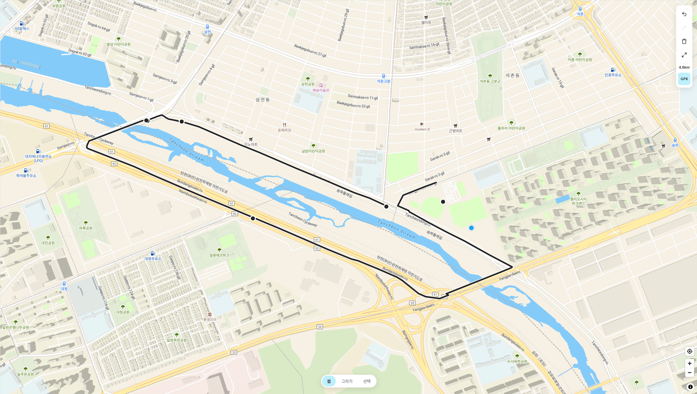
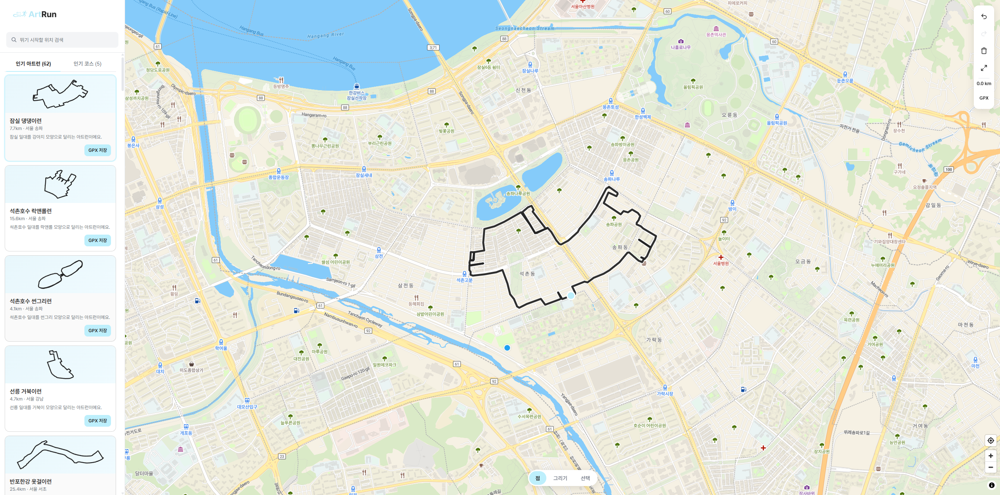

<div align="center">
  
  <a href="https://htjworld.github.io/art-run/">🔗 서비스 바로가기</a>
</div>

<br />

> 지도 위에서 직접 경로를 그리고 GPX로 내보내는 아트런 설계 도구

## Background

러닝 중 아트런에 관심이 생겼지만, 경로를 직접 그리는 방법을 알기 어려웠습니다.
보통은 네이버 블로그 등에서 완성된 GPX 파일을 찾아 카카오지도에 넣는 방식을 씁니다.
원하는 그림을 직접 설계해 GPX로 만들어주는 도구는 찾기 어려웠고, 지원하는 앱도 많지 않았습니다.

지도 위에서 경로를 그리면 인도·보행로를 따라 자동으로 이어지고, 완성된 경로를 GPX로 바로 내보낼 수 있는 서비스를 만들었습니다.
아트런 외에도 인기 러닝 코스를 함께 탐색할 수 있도록 코스 갤러리도 포함했습니다.

## Features

- 점 모드 그리기 — 지도를 탭할 때마다 들려야 할 스팟을 찍으면 보행로를 따라 경로가 이어집니다
- 그리기 모드 — 손가락/커서로 자유롭게 그리면 건물·구역을 감싸는 인도를 따라 경로가 완성됩니다
- GPX 내보내기 — Strava, 카카오지도에 바로 쓸 수 있는 GPX 파일을 다운로드합니다
- 인기 아트런 갤러리 — 고구마런, 하트런 등 큐레이션된 아트런 코스를 지도 위에서 탐색합니다
- 인기 러닝 코스 갤러리 — 한강, 올림픽공원 등 주요 코스를 함께 제공합니다

## Preview

| <경로 그리기 화면> | <코스 갤러리 화면> |
|---|---|
|  |  |

## Tech Stack

**Frontend**  
[](https://skillicons.dev)

**Infra**  
[](https://skillicons.dev)

## Getting Started

**Requirements**
- Node.js 20+
- pnpm

**macOS / Linux**
```bash
git clone https://github.com/htjworld/art-run.git
cd art-run
pnpm install
cp .env.example .env.local  # API 키 입력 (없어도 기본 동작)
pnpm dev
```

**Windows**
```bash
git clone https://github.com/htjworld/art-run.git
cd art-run
pnpm install
copy .env.example .env.local
pnpm dev
```

`.env.local`에 설정 가능한 키는 다음과 같습니다.

| 변수 | 설명 | 없을 때 |
|---|---|---|
| `VITE_ORS_KEY` | OpenRouteService API 키 — 경로 계산에 사용 | 경로 그리기 비활성 |
| `VITE_MAP_KEY` | MapTiler Cloud API 키 — 한국어 지도 타일 | OpenFreeMap으로 대체 |
| `VITE_KAKAO_KEY` | 카카오 JavaScript API 키 — 위치 검색에 사용 | 위치 검색 비활성 (모바일·데스크톱 공통) |

## License

MIT © htjworld
